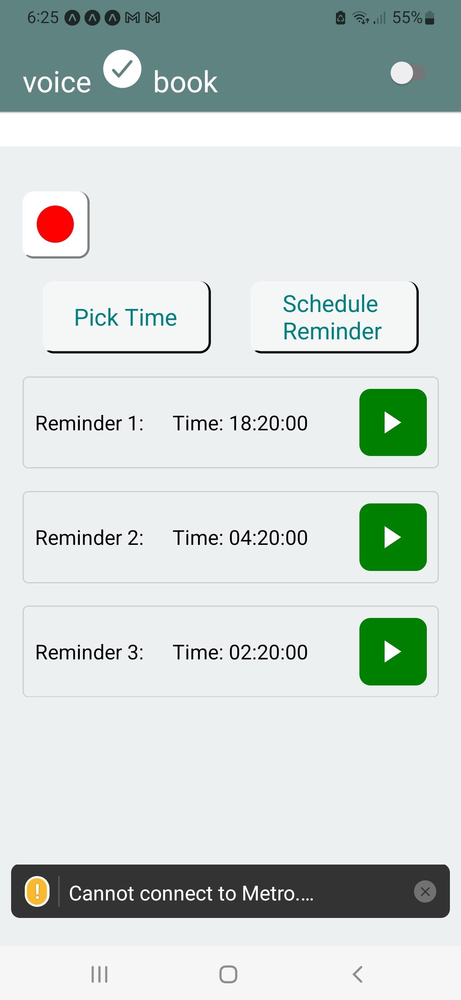

### Voice Book (expo / react-native)
###### Record multiple voice memos, and set them as reminders
###### Author: A.Agabekian
#### Setup 
`npm install`
#### Run 
`npx expo start`
#### Using VoiceBook
**Recording a Reminder:**

Tap the "Record" button to start recording your reminder.
After recording, the reminder audio can be played back by tapping the play button.

**Scheduling a Reminder:**

Tap "Pick Time" to select the desired time for your reminder using the date and time picker.
Once selected, tap "Schedule Reminder" to save and schedule your reminder.
You will receive a notification at the scheduled time to listen to your reminder.

Switching Themes:

Toggle the switch at the top right corner to switch between dark and light themes.

#### Screenshot

#### Fatures
### UML
    -----------------------------------
    |             App                 |
    -----------------------------------
    | - reminderUri: string           |
    | - time: Date                    |
    | - showTimePicker: boolean       |
    | - reminders: Array<object>      |
    | - isDarkMode: boolean           |
    | - notificationPermissionGranted: boolean |
    -----------------------------------
    | + useEffect()                   |
    | + handleSaveRecording(uri: string) |
    | + handleScheduleReminder()      |
    | + onChange(event, selectedTime) |
    | + toggleTheme()                 |
    | + renderReminder(item)          |
    -----------------------------------
    
    -----------------------------------
    |          PlayAudio              |
    -----------------------------------
    | - sound: AudioObject            |
    | - isPlaying: boolean            |
    -----------------------------------
    | + playAudio()                   |
    -----------------------------------
    
    -----------------------------------
    |         RecordAudio             |
    -----------------------------------
    | - isRecording: boolean          |
    | - recording: AudioObject        |
    -----------------------------------
    | + startRecording()              |
    | + stopRecording()               |
    -----------------------------------
    
    -----------------------------------
    |         Notifications           |
    -----------------------------------
    | - notificationHandler: Object   |
    -----------------------------------
    | + setNotificationHandler()      |
    -----------------------------------
    
    -----------------------------------
    |        DateTimePicker           |
    -----------------------------------
    | - value: Date                  |
    -----------------------------------
    | + onChange(event, selectedTime) |
    -----------------------------------
    
